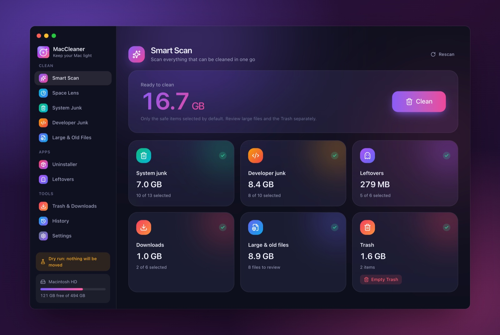
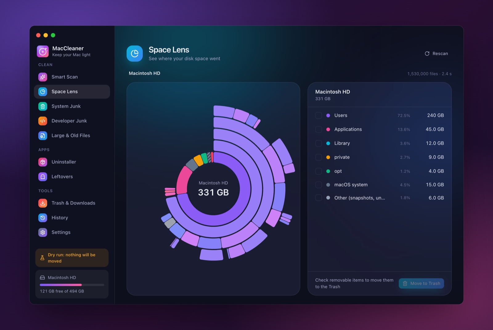
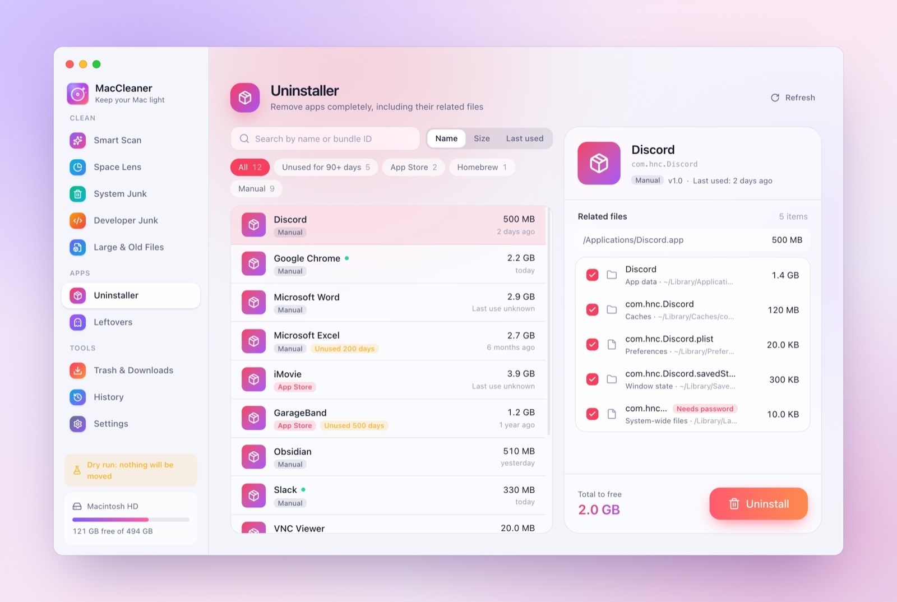

# MacCleaner

[中文说明](README.zh-CN.md)

A disk cleaner and app uninstaller for macOS on Apple silicon. It runs entirely on your Mac: no network access, no data collection. Built with Tauri 2 (Rust) and React.

<p align="center"></p>
<p align="center">
  
  
</p>

## Features

| Module | What it does |
|---|---|
| Smart Scan | Runs System Junk, Developer Junk, Leftovers, Downloads, Large & Old Files and Trash (Trash needs Full Disk Access) one after another and adds up what can be cleaned. The Clean button only handles the first four; large files and the Trash are for you to review. |
| Space Lens | Scans the whole internal data volume and shows a sunburst chart you can click into. Items you are allowed to delete can be moved to the Trash from here. |
| System Junk | App caches (`~/Library/Caches`), logs, crash reports, and temporary files untouched for 3 days. |
| Developer Junk | npm / pip / Yarn / pnpm / Bun / Cargo / Go / Gradle / Maven / Xcode caches, and `node_modules` of projects untouched for 90 days. Two optional command items, never preselected: `brew cleanup --prune=all` (Homebrew cache and old versions) and `docker system prune -f` (stopped containers and build cache). |
| Large & Old Files | Big or long-unused files anywhere in your home folder. Defaults: 500 MB or larger, or 100 MB and not used for a year; thresholds are adjustable. Filter by type. Nothing is selected by default. |
| Uninstaller | Lists apps in `/Applications` and `~/Applications` with size, source (App Store / Homebrew / manual) and last use, and removes an app together with its related files. |
| Leftovers | Settings, caches and data left behind by apps that are no longer installed. |
| Trash & Downloads | Empty the Trash; tidy `~/Downloads` (installers older than a month are suggested). |
| History | Every clean-up and dry run, stored only on this Mac. |

Interface in English and Simplified Chinese; light, dark or system appearance.

## How it keeps your files safe

- **Dry run is on by default.** Clean-ups only list what would happen. Turn it off in Settings when you trust the results. It is enforced in the Rust backend, not just the UI.
- **Files and folders go to the Trash**, so they can be put back. Items owned by the administrator are moved by Finder, which asks for your password. Only two things delete permanently, and each is flagged before you confirm: *Empty Trash*, and the command items `brew cleanup` / `docker system prune`.
- **Uninstalling a Homebrew app** moves it to the Trash like any other app, then runs `brew uninstall --cask` so Homebrew forgets it. If the cask defines uninstall steps, Homebrew runs them.
- **Every file or folder is re-checked right before it is moved** (`src-tauri/src/safety.rs`):
  - never: macOS system folders, Keychains, privacy databases, Apple app data, Photos and Music libraries, MacCleaner itself;
  - never a single file inside an app bundle, an iWork document, a disk image bundle or a Git repository's `.git` folder (only the whole thing);
  - never top-level folders such as `~/Library/Caches`, `~/Downloads` or `~/Projects` themselves, only their contents;
  - not if the path is in the whitelist, changed size since the scan, is a cache of a running app, or is open in any of your processes.
- **Whitelist.** Starts with personal-data locations (Documents, `.ssh`, `.gnupg`, iCloud Drive, cloud storage, Mail, Messages, Safari, Accounts, Calendars, Contacts, call history, iPhone backups, Photos). Whitelisted paths are never moved; command items and Empty Trash are not path-based and are not covered. They are marked "Default" in Settings and can be removed or restored there; you can add your own paths too. Matching ignores upper/lower case.
- Scan results live in memory only; settings and history are in `~/Library/Application Support/MacCleaner/`.

## Requirements

- A Mac with Apple silicon (M-series). Intel Macs are not supported.
- macOS 15 or later. Tested on macOS 26; macOS 15 and 27 should work but are untested.
- MacCleaner is signed with a self-signed certificate, not notarized by Apple (see first launch below).

## Install

### Option A: from a MacCleaner `.dmg`

1. Open the dmg and either drag MacCleaner onto the Applications folder, or double-click MacCleaner in the dmg and choose **Install and open** (see [Update](#update)). The dmg also contains this README in English and Chinese.
2. First launch: macOS blocks it because it isn't notarized. Double-click MacCleaner, click **Done**, then open **System Settings → Privacy & Security**, scroll down to **Security**, click **Open Anyway** next to MacCleaner and enter your password. MacCleaner then opens (if it doesn't, open it again and click **Open**).
   If you use Terminal, `xattr -dr com.apple.quarantine /Applications/MacCleaner.app` does the same.
   Company-managed Macs may not allow this at all.

### Option B: build from source

Prerequisites: Command Line Tools (`xcode-select --install`), Rust via [rustup](https://rustup.rs), Node.js 20.19+ or 22.12+.

```bash
npm install
./scripts/setup-signing.sh   # once per Mac: creates the local signing identity
./scripts/build-install.sh   # builds, signs and installs /Applications/MacCleaner.app
```

`setup-signing.sh` creates a self-signed certificate in its own keychain (`~/Library/Keychains/maccleaner-signing.keychain-db`); its password is stored in your login keychain. A stable signature keeps the permissions you grant valid across rebuilds.

Always run the copy in `/Applications`. The build output in `src-tauri/target/` is overwritten by every build.

### Option C: copy a built `MacCleaner.app`

If someone gives you the app itself (for example zipped), open it from wherever it is and choose **Install and open**, or move it into `/Applications` yourself. The first launch needs step 2 of option A.

## First launch and daily use

1. The welcome screen explains the safety model. Grant **Full Disk Access**: *Open System Settings* → Privacy & Security → Full Disk Access → turn on MacCleaner (click **+** if it's missing), then quit and reopen MacCleaner. Without it the Trash, other apps' containers and some system folders can't be read.
2. Start with **Smart Scan**, or open a module in the sidebar and click **Scan**.
3. Review the list: uncheck what you want to keep, use the eye icon for Quick Look, right-click to add a path to the whitelist.
4. Click **Clean**, review the confirmation list, confirm. With dry run on nothing is moved; the result shows what would have happened.
5. When you're happy with the results, turn off dry run in **Settings**. Cleaned items then go to the Trash; space is freed once you empty it (Trash & Downloads → Empty Trash).

The first time MacCleaner moves an administrator-owned item or empties the Trash, macOS asks whether MacCleaner may control Finder; allow it.

## Update

Open the new version from wherever it is (the dmg, Downloads, a zip). When MacCleaner runs from outside the Applications folder it asks whether to install:

- nothing installed yet: **Install and open**;
- an older version installed: shows both versions and offers **Update and reopen**;
- the same or a newer version installed: offers to reinstall or replace, with a warning for older versions;
- a different app called MacCleaner.app in Applications: refuses and asks you to deal with it first.

On confirm it asks a running older copy to quit, moves the installed version to the Trash (so you can put it back), copies itself into `/Applications` and reopens from there. If your account can't write to `/Applications`, macOS asks for an administrator password. Settings, whitelist and history are kept.

Dragging the new version into Applications and choosing **Replace** in Finder also works (quit MacCleaner first). Developers can run `./scripts/build-install.sh`, which quits a running copy first.

Full Disk Access stays granted as long as the new version is signed with the same identity (built on the same Mac with the same signing keychain). A newly downloaded version may need **Open Anyway** again the first time.

## Uninstall

1. Quit MacCleaner.
2. Move `/Applications/MacCleaner.app` to the Trash.
3. Optional, to remove everything it created, move these to the Trash too (some may not exist):
   - `~/Library/Application Support/MacCleaner` (settings, whitelist, history)
   - `~/Library/Caches/app.maccleaner.MacCleaner`
   - `~/Library/WebKit/app.maccleaner.MacCleaner`
   - `~/Library/HTTPStorages/app.maccleaner.MacCleaner`
   - `~/Library/Saved Application State/app.maccleaner.MacCleaner.savedState`
4. Optional: remove its privacy permissions (Full Disk Access, Finder automation):
   ```bash
   tccutil reset All app.maccleaner.MacCleaner
   ```
5. Only if you built it yourself and won't build again, remove the signing identity:
   ```bash
   security delete-keychain ~/Library/Keychains/maccleaner-signing.keychain-db
   security delete-generic-password -s maccleaner-signing-keychain
   ```

## Packaging a release

Everything runs on your own Mac; nothing is uploaded.

1. Once per Mac: install the prerequisites from option B, run `npm install`, then `./scripts/setup-signing.sh`.
2. Set the new version in `src-tauri/tauri.conf.json` (`version`). Keep `package.json` and `src-tauri/Cargo.toml` at the same number.
3. Run the checks: `npm run typecheck && npm run check:i18n && npm test && (cd src-tauri && cargo test)`.
4. Build the dmg:
   ```bash
   ./scripts/package-dmg.sh              # builds, signs, packages
   ./scripts/package-dmg.sh --no-build   # repackage the last build only
   ```
   Output: `release/MacCleaner_<version>_aarch64.dmg` (not tracked by git) and its SHA-256 checksum. The dmg contains `MacCleaner.app`, a shortcut to Applications, and both READMEs.
5. Send the dmg and its checksum. Recipients follow [Install](#install).

Build every release on the same Mac with the same signing keychain. Then updates keep the permissions people already granted. If the keychain is lost, a new identity is created and everyone has to grant Full Disk Access again. To keep it safe, back up `~/Library/Keychains/maccleaner-signing.keychain-db` together with its password (`security find-generic-password -s maccleaner-signing-keychain -w`), for example in a password manager.

## Development

```bash
npm run dev          # UI in the browser with mock data: http://localhost:1420
                     # e.g. ?theme=light&lang=en&page=space, ?onboarding, ?nofda
npm run tauri dev    # the real app (inherits Terminal's permissions)
npm run typecheck
npm test             # frontend unit tests (vitest)
npm run check:i18n   # zh-CN and en keys match; every key used exists
npm run icons        # regenerate icons from src/assets/logo.svg

cd src-tauri
cargo test                                         # unit and IPC tests (see note below)
cargo test real_probe  -- --ignored --nocapture    # read-only scan of this Mac
cargo test large_probe -- --ignored --nocapture    # read-only large-file scan
cargo test smart_probe -- --ignored --nocapture    # read-only: what Smart Scan would preselect
cargo test disk_probe  -- --ignored --nocapture    # read-only whole-disk scan
```

`cargo test` works on temporary folders and uses its own settings folder. One test moves a temporary file it created to your Trash and deletes it from there again.

To build a dmg, see [Packaging a release](#packaging-a-release).

### Project layout

```
src/                 React UI (pages/, components/, lib/api.ts, lib/mock.ts, i18n/)
src-tauri/src/
  lib.rs             Tauri commands, menu
  installer.rs       install / update into /Applications
  safety.rs          what may be moved (every file or folder goes through it)
  cleaner.rs         move to Trash, dry run, commands, uninstall
  disk.rs            Space Lens scanner
  junk.rs            system / developer junk, large files, trash, downloads
  apps.rs            installed apps, related files, leftovers
  inuse.rs           files open in running processes (lsof)
  mac.rs             macOS APIs: Trash, running apps, icons, Finder, Spotlight
  settings.rs, history.rs
scripts/             signing, build/install, dmg, icons, i18n check
```

## Known limitations

- Not notarized; other Macs must allow it once in Privacy & Security.
- Apps' background login items keep running until the next restart after uninstalling.
- A Homebrew cask's own uninstall steps run through Homebrew, outside MacCleaner's checks.
- Space that APFS clones would free is an estimate.
- External and network drives are not scanned.
- The real app window can't be tested automatically on macOS; deletion through Finder, `brew`, `docker` and quitting apps is verified manually.

## License

[MIT](LICENSE). MacCleaner moves and deletes files on your Mac; it is provided as is, without warranty. Keep dry run on until you trust the results.
